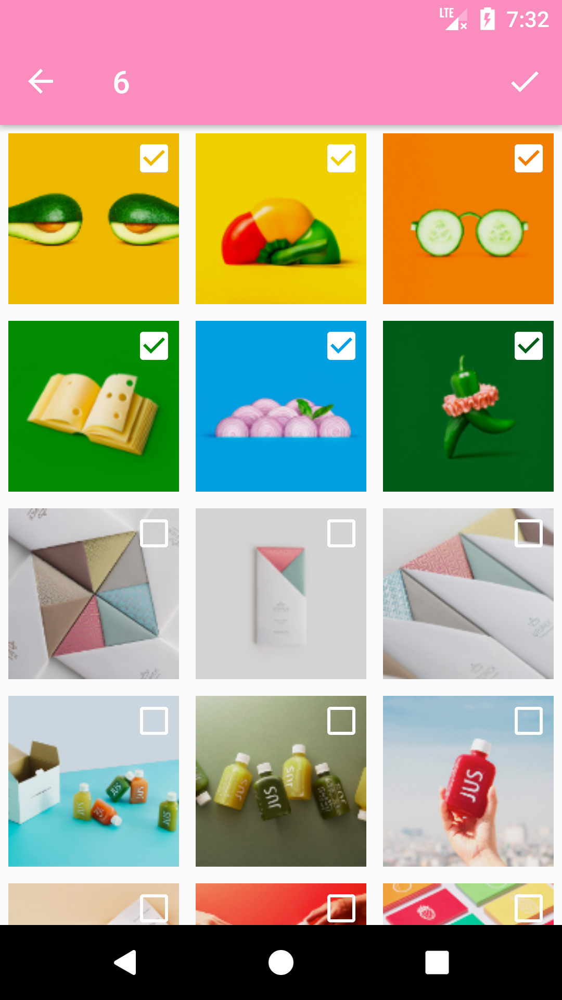
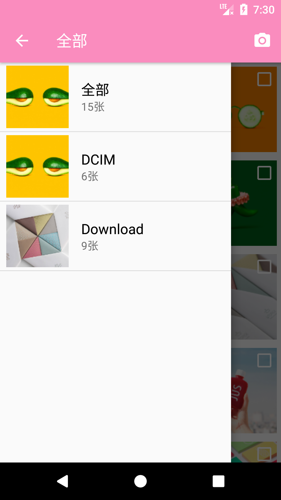
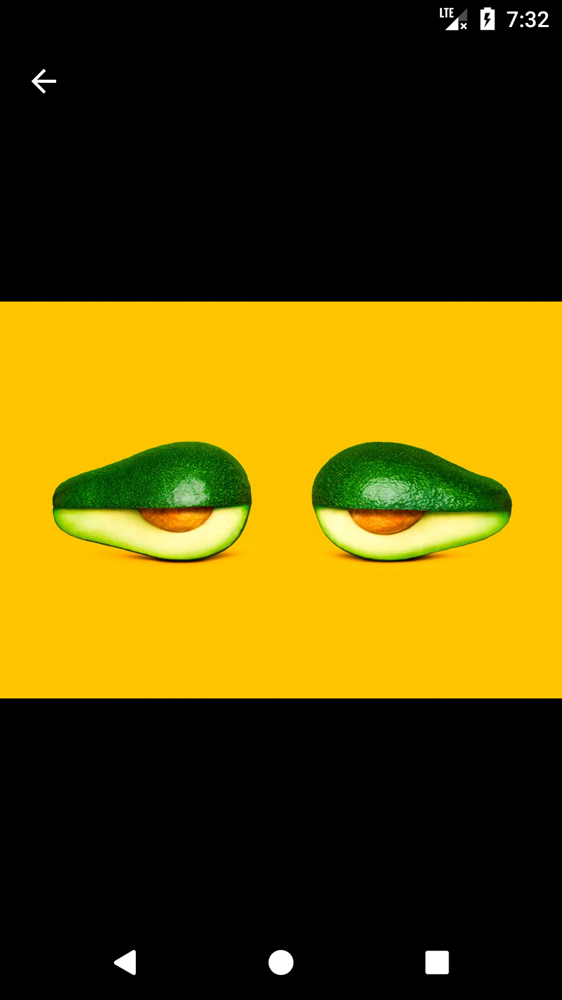

[](https://jitpack.io/#qiujayen/Daguerre)

# Daguerre
一个`Android`本地图片和视频的选择器
- 可以在Activity或Fragment中使用
- 选择图片支持多种格式，如：JPEG, PNG, GIF
- 选择视频支持多种格式，如：3GP, MPEG, MP4
- 可以自定义主题样式
- 可自定义不同的图片加载器

| Select Image 1                 | Select Image 1                    | Preview                          |
|:------------------------------:|:---------------------------------:|:--------------------------------:|
| |  | |

## Download Demo Apk
|[apk](apk/sample-debug.apk)|
|:-:|
||

## How to
### Step 1. Add the JitPack repository to your build file
Add it in your root build.gradle at the end of repositories:
```groovy
allprojects {
	repositories {
		...
		maven { url 'https://jitpack.io' }
	}
}
```

### Step 2. Add the dependency
```groovy
dependencies {
	implementation 'com.github.qiujayen:Daguerre:last-version'
}
```
### This library dependencies
```groovy
implementation 'com.android.support:appcompat-v7:version code'
implementation 'com.android.support:recyclerview-v7:version code'
implementation 'com.github.chrisbanes:PhotoView:version code'
```

## How to use Daguerre?
#### Permission
The library requires two permissions:
- `android.permission.READ_EXTERNAL_STORAGE`
- `android.permission.WRITE_EXTERNAL_STORAGE`

So if you are targeting Android 6.0+, you need to handle runtime permission request before next step.

#### Simple use
```java
Daguerre.with(this)
        .theme(R.style.CustomTheme) // 设置主题样式，不设置则使用默认主题
        .spanCount(3) // 设置列表列数，默认为3
        .maxSelectable(3) // 设置最大选择数据，默认为1
        .mimeType(MimeType.IMAGE, MimeType.JPEG) // 设置mimeType，默认会显示所有图片与视频
        .setImageLoader(new ImageLoader()) // 设置图片加载器，必须设置的参数，否则图片等资源无法显示
        .launch(REQUEST_CODE);
```
#### Obtain Result
```java
@Override
protected void onActivityResult(int requestCode, int resultCode, Intent data) {
    super.onActivityResult(requestCode, resultCode, data);
    if (requestCode == PHOTO && resultCode == RESULT_OK) {
        ArrayList<String> photos = Daguerre.obtainResultSet(data);
    } else if (requestCode == VIDEO && resultCode == RESULT_OK) {
        String videoPath = Daguerre.obtainResult(data);
    }
}
```

#### Themes attrs

| attr                           | doc                      | default value|
|:------------------------------|:------------------------------|:------------------------------:|
| daguerreCheckButtonColor       | 选择图片 CheckBox 按钮颜色  | white |
| daguerreActionDrawableColor    | ActionBar 菜单图标颜色     | white |
| daguerreActionModeDrawableColor| ActionMode 确认按钮图标颜色 | white |
| daguerreBadgeColor             | 列表中标记视频的图标颜色     | white |

#### Themes Style
参考`Activity`主题样式设置

#### More
Find more details about Daguerre in [wiki](https://github.com/qiujayen/Daguerre/wiki).

## Thanks
This library is inspired by [Matisse](https://github.com/zhihu/Matisse) and uses some of its source code.

## License
Copyright 2017 QiuJay Inc.

Licensed under the Apache License, Version 2.0 (the "License");
you may not use this file except in compliance with the License.
You may obtain a copy of the License at

   http://www.apache.org/licenses/LICENSE-2.0

Unless required by applicable law or agreed to in writing, software
distributed under the License is distributed on an "AS IS" BASIS,
WITHOUT WARRANTIES OR CONDITIONS OF ANY KIND, either express or implied.
See the License for the specific language governing permissions and
limitations under the License.
